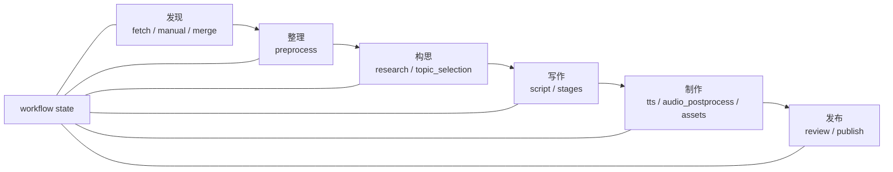
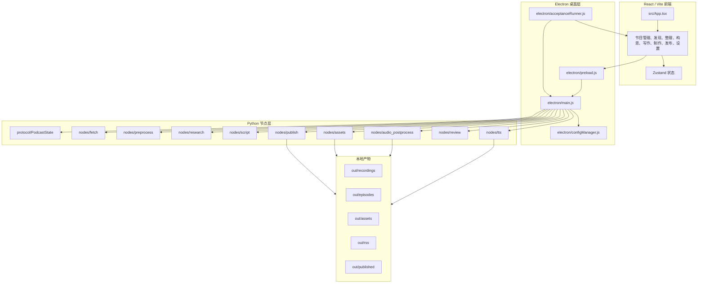

# Auto-Podcast Studio

中文桌面端 AI 播客工作台：把“发现素材 -> 整理候选 -> 构思结构 -> 写作脚本 -> 录制/生成音频 -> 本地/RSS 发布”做成一条可恢复、可检查、可调试的节目制作流程。


## 它是什么

Auto-Podcast Studio 不是单次提示词生成器，而是一个本地运行的播客生产工作台。项目由 Electron 桌面壳、React/Vite 前端、Python 节点工作流和内置素材采集源组成。

它当前重点解决三件事：

1. 把播客制作拆成稳定阶段：发现、整理、构思、写作、制作、发布。
2. 把每个阶段的状态写回 workflow state，方便恢复、检查和继续编辑。
3. 提供 CDP AI 自验收能力，让 AI 可以真实接入 Electron 页面执行关键路径。

## 当前能力

| 能力 | 当前实现 |
| --- | --- |
| 节目管理 | 支持节目新增、打开、保存、复制、删除、导入、导出和卡片列表展示。 |
| 流程导航 | 左侧常驻流程导航，按发现、整理、构思、写作、制作、发布排列，并显示阶段状态。 |
| 素材发现 | 支持内置 RSS/API 数据源和手动素材进入素材池。 |
| 素材整理 | 对素材进行清洗、候选筛选和状态写回。 |
| 创作构思 | 从候选素材组织节目主题、讨论点和结构草案。 |
| 脚本写作 | 支持分段编辑脚本，并将 `script/stages` 写入 workflow state。 |
| 真人录制 | 使用浏览器媒体 API 录制 WebM/Opus，并通过 Electron IPC 保存到本地。 |
| AI 配音 | 通过 `tts` 节点生成分段音频；可用性取决于设置页中配置的音频生成接口。 |
| 音频后处理 | `audio_postprocess` 节点将录音或 TTS 分段合成为最终音频。 |
| 发布导出 | `publish` 节点生成本地发布目录和 RSS 文件；未配置的平台不会伪造成功。 |
| CDP 自验收 | `npm run acceptance:cdp` 启动真实 Electron，执行创建、写作、录音、音频、发布链路。 |

## 工作流



每个节点都读取同一个 state，执行后再把结果写回 state。前端展示的是这个状态，而不是只做静态 UI。

## 架构图



## 界面预览

### 创作台

从素材池中选择素材，组织节目主题、延伸讨论和背景补充。


### 写作协作

脚本阶段支持分段编辑，并把脚本结构写入 workflow state。


### 声音工作台

制作阶段支持真人录制和音频生成入口，最终由音频后处理节点生成节目音频。


### 发布中心

发布阶段运行 review/publish 节点，生成本地发布目录和 RSS。


### 设置中心

设置页用于配置搜索、模型、音频、发布和日志查看等本地能力。


## 快速开始

### 环境要求

- Node.js 18 或更高版本。
- Python 3.8 或更高版本，推荐 Python 3.11。
- 当前主要在 Windows 环境下调试；Electron 开发模式也可在 macOS/Linux 运行。

### 安装

```bash
npm install
```

`postinstall` 会执行：

```bash
python -m pip install -e . -i https://pypi.tuna.tsinghua.edu.cn/simple
```

该步骤以可编辑模式安装 Python 节点包。

### 启动

```bash
npm start
```

等价于：

```bash
npm run dev
```

它会同时启动：

- `npm run dev:react`：启动 Vite 前端，默认 `http://127.0.0.1:5174`。
- `npm run dev:electron`：等待 Vite 就绪后启动 Electron。

## 常用命令

```bash
npm start                 # 启动 Vite + Electron
npm run dev:react         # 只启动 Vite 前端
npm run dev:electron      # 只启动 Electron，需 Vite 已就绪
npm run dev:cdp           # 启动 Vite + Electron，并开启 CDP 调试端口
npm run dev:electron:cdp  # 只启动带 CDP 调试端口的 Electron
npm run acceptance:cdp    # 执行真实 Electron CDP AI 自验收
npm run verify            # 验证配置和节点
npm run build             # TypeScript + Vite 构建
npm run build:electron    # Electron Builder 打包
npm run test              # 运行节点与集成测试
```

## CDP AI 调试与自验收

默认 `npm start` 不开启外部 CDP 调试端口。需要让 AI 或 Chrome DevTools 接入真实 Electron 页面时，使用：

```bash
npm run dev:cdp
```

默认 CDP 地址：

```text
http://127.0.0.1:9222
```

CDP 相关环境变量：

| 变量 | 作用 |
| --- | --- |
| `CDP_DEBUG=1` | 开启外部 CDP 调试端口。 |
| `CDP_PORT=9222` | 指定 CDP 端口，默认 `9222`。 |
| `CDP_HOST=127.0.0.1` | 指定监听地址，默认仅本机。 |
| `CDP_FAKE_MEDIA=1` | 使用 fake microphone 和自动授权，适合录音链路验收。 |
| `CDP_ACCEPTANCE=1` | 启动后自动运行内置 CDP 自验收。 |
| `CDP_ACCEPTANCE_QUIT=0` | 自验收结束后不自动退出 Electron。 |

执行自验收：

```bash
npm run acceptance:cdp
```

该命令会启动或复用 `http://127.0.0.1:5174`，再启动真实 Electron 应用，由 `electron/acceptanceRunner.js` 通过 `webContents.debugger` 执行以下路径：

1. 读取首页 DOM。
2. 创建节目和 workflow state。
3. 写入脚本和 stages。
4. 使用 fake media 录制 WebM。
5. 运行音频后处理、资产、review。
6. 运行 publish，生成 RSS 和本地发布目录。
7. 收集 console error、runtime exception、network failure。

验收输出：

```text
docs/acceptance/CDP_ACCEPTANCE_REPORT.md
docs/acceptance/screenshots/<timestamp>/
```

## 配置

### 应用内配置

推荐通过设置页配置 AI 能力、搜索策略、创作偏好、音频生成和发布参数。Electron 会把节点配置保存到本机用户数据目录下的 `node-configs` 文件夹。

示例：

```text
<Electron userData>/node-configs/fetch.json
<Electron userData>/node-configs/script.json
<Electron userData>/node-configs/tts.json
```

### 环境变量

兼容 OpenAI 的文本模型服务通常需要：

```env
OPENAI_API_KEY=your-api-key
OPENAI_API_BASE=https://api.openai.com/v1
```

节点配置中的 `api_key`、`api_base`、`llm_model` 等字段为空时，会按节点逻辑回退读取环境变量。

### YAML 示例

仓库提供 `config.example.yaml`：

```bash
copy config.example.yaml config.yaml
```

该文件覆盖抓取、预处理、研究、选题、脚本、TTS、音频后处理、封面、存储和发布等配置示例。

## 目录结构

```text
auto-podcast/
├── electron/              # Electron 主进程、预加载脚本、配置管理、CDP 验收
├── engine/                # 项目本地采集辅助模块
├── nodes/                 # Python 工作流节点
├── protocol/              # 共享 state 和配置基类
├── scripts/               # 验证、同步、测试和 CDP 自验收脚本
├── src/                   # React 前端
├── tests/                 # Python 测试
├── docs/                  # 文档、截图、验收报告
├── config.example.yaml    # 节点配置示例
├── package.json           # Node/Electron 脚本和依赖
└── pyproject.toml         # Python 包和依赖
```

## 关键实现

### Electron IPC

前端通过 `electron/preload.js` 暴露的 `window.electronAPI` 调用主进程能力。主进程负责 workflow 生命周期、节点执行、配置读写、录音保存、文件打开和 CDP 自验收。

### Python 节点协议

Electron 使用子进程运行节点：

```text
Electron IPC
  -> python -m nodes.<node_name>
  -> 节点从 stdin 读取完整 state
  -> 节点向 stdout 输出 JSON state
  -> Electron 更新前端 workflow state
```

节点通过 `PodcastState` 读写字段，例如：

```text
raw_contents
cleaned_contents
selected_topic
script
stages
audio_segments
final_audio_path
rss_path
publish_status
```

### 内置素材采集

`fetch` 节点会动态加载 `nodes/fetch/sources/` 下的内置数据源，并统一转换为素材列表。当前内置源包括 Hacker News、TechCrunch 和 AI 资讯快报。

## 输出产物

默认输出路径由节点配置决定，常见目录包括：

| 目录 | 内容 |
| --- | --- |
| `out/recordings` | 真人录制保存的 WebM/Opus 音频。 |
| `out/audio_segments` | TTS 生成的分段音频。 |
| `out/episodes` | 后处理后的节目音频。 |
| `out/assets` | 封面等资产。 |
| `out/published` | 本地发布目录。 |
| `out/rss` | RSS 输出目录。 |

这些目录是运行产物，不建议提交到 Git。

## 开发约定

- 新增节点时，在 `nodes/<name>/` 下提供 `config.py`、`node.py` 和 `__main__.py`。
- 节点之间不直接导入彼此代码，通过 state 交换数据。
- 节点异常应写入 `state["errors"]`，过程信息写入 `state["logs"]`。
- 配置字段通过 Pydantic 描述默认值和校验规则。
- 敏感信息不要写入仓库，优先使用应用设置页、本机配置或环境变量。
- 涉及主路径 UI 的改动，优先跑 `npm run acceptance:cdp` 做真实页面验收。

## 常见问题

### 启动后没有窗口

先确认 Vite 是否启动成功：

```bash
npm run dev:react
```

浏览器打开：

```text
http://127.0.0.1:5174
```

如果前端正常，再单独启动 Electron：

```bash
npm run dev:electron
```

### Python 节点执行失败

先运行节点验证：

```bash
npm run verify:nodes
```

再确认 Python 版本和包安装：

```bash
python --version
python -m pip install -e .
```

### 模型列表拉取失败

检查设置页中的 API Base、API Key 和模型名称。兼容 OpenAI 的服务通常需要形如：

```text
https://api.example.com/v1
```

的 API Base，并且服务端需要支持 `/models` 或对应节点实际调用的接口。

### 素材发现没有数据

先在发现页确认至少启用了一个内置数据源，再检查网络连通性和对应源站是否可访问。也可以运行：

```bash
npm run verify:nodes
```

确认 `fetch` 节点和数据源模块可以被正常加载。

## License

MIT
