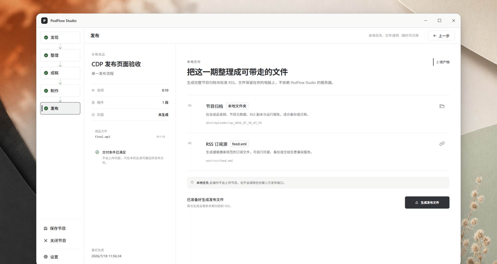

<div align="center">



# PodFlow Studio

**本地优先的 AI 新闻播客制作工作台**

从素材发现、整理与事实卡片，到口播稿、配音、音频成片和 RSS 发布包，一条工作流完成一期节目。

</div>

## PodFlow Studio 是什么

PodFlow Studio 面向独立创作者和小型编辑团队，把每天重复的新闻播客生产流程放进一个桌面应用。它默认服务约 22 分钟的单人新闻早报，但素材数量、节目结构和声音方案都可以按实际内容调整。

它不是一个只会“生成文案”的聊天框。素材会沿着明确的编辑链路前进：先收集和整理来源，再形成事实卡片与可编辑稿件，最后进入配音、音频装配和发布。关键节点保留人工确认，来源与 AI 补充知识也会分开呈现。

```text
发现素材 → 整理与研究 → 事实卡片 → 口播稿 → 配音 / 录音 → 音频成片 → RSS / 发布包
```

## 核心能力

- **发现素材**：从 RSS、网页、手动笔记、AI News Daily 和 NewsNow 聚合源采集内容，并按时效、主题和数量筛选。
- **整理与研究**：围绕候选选题补充背景、管理参考来源，把网络证据与 AI 知识分开处理。
- **事实驱动写作**：先生成结构化 `FactCard`，再写出口播稿，减少原始素材直接进入生成提示带来的失真。
- **可编辑成稿**：保留生成稿和人工编辑稿；后续 TTS 始终优先使用已编辑版本。
- **灵活配音**：支持 mock TTS、Edge TTS、OpenAI-compatible TTS，以及分段真人录音替换。
- **自动成片**：合并语音片段、插入段间停顿，并在工具可用时完成响度处理和 MP3 导出。
- **发布交付**：生成节目音频、`feed.xml`、节目元数据和运行报告，组装为可检查的发布包。
- **本地优先**：工作流和中间产物保存在本机；没有外部 API Key 也能运行完整离线 demo。

## 安装

### 环境要求

- 当前 Node.js LTS
- Python 3.13
- Windows 10 / 11（当前主要桌面开发与验证环境）
- 可选：FFmpeg，用于导出 MP3 和进行音频后处理

### 本地运行

```bash
git clone https://github.com/liuminxin45/podflow-studio.git
cd podflow-studio
npm install
npm run setup:python
npm run dev
```

首次启动后，在「设置」中配置实际要使用的模型、搜索和语音服务。你不需要一次配置所有 Provider；只配置当前工作流需要的服务即可。

## 最快上手

如果想先确认完整链路是否可用，运行离线 demo：

```bash
npm install
npm run setup:python
npm run demo:news
```

这条路径不依赖外网、LLM Key 或 TTS Key。没有真实 TTS 时会生成 mock WAV；检测到 FFmpeg 时输出 `final.mp3`，否则保留 `final.wav` 并在报告中记录降级原因。

运行完成后，主要结果位于 `examples/demo-news/output/`：

```text
facts.json                 # 结构化事实卡片
script.generated.json      # AI / deterministic 生成稿
script.edited.json         # 可人工编辑的最终稿
final.mp3 或 final.wav      # 成片音频
feed.xml                   # RSS feed
run_report.json            # 运行结果、告警与降级信息
dist/episodes/<episode_id> # 完整发布包
```

## 使用方式

桌面端的每个区域只负责一类清晰任务：

1. **发现**：选择内容源和时间范围，查看来源级采集进度，筛选值得进入节目的素材。
2. **整理**：收敛选题，补充研究资料和分析角度，确认哪些内容被正式采纳。
3. **成稿**：检查事实卡片和节目结构，编辑真正要播出的口播稿。
4. **制作**：为稿件分段生成语音，或替换为真人录音，然后自动装配最终音频。
5. **发布**：检查节目元数据、音频和警告，导出 RSS 与发布包。

默认 preset 为 `morning_news_brief`，推荐“9 条快讯 + 1 条深度解读”，目标时长约 22 分钟。推荐结构不是硬限制：素材质量不足时可以减少条目，也可以按选题需要调整数量。

## 关键设计

### 事实卡片，而不是素材拼接

`FactCard` 是来源与稿件之间的事实层。写作节点消费经过整理的事实，而不是把网页原文直接拼进 Prompt。这样更容易检查每个结论来自哪里，也便于在成稿前修正。

### 人工编辑稿优先

系统同时保留生成稿和 `edited_script`。一旦存在人工编辑稿，TTS 和后续制作链路会优先使用它，避免重新生成覆盖已经确认的表达。

### 可解释的降级

外部模型、TTS 或 FFmpeg 不可用时，流程会尽可能产生可检查的替代结果，并把降级写入 `run_report.json`。失败不会被伪装成成功。

### 本地预览与公网发布分离

当 `publish.public_base_url` 为空时，生成的 RSS 仅供本地预览，并非公网可订阅 Feed。运行报告会明确给出这一警告。

## 配置

桌面端「设置」可以管理常用配置；仓库中的 `config.example.yaml` 展示了完整配置结构。密钥请放在本地环境或桌面端配置中，不要写入仓库。

当前可接入的能力包括：

- OpenAI-compatible LLM
- Edge TTS 与 OpenAI-compatible TTS
- RSS / 网页内容源
- AI News Daily 与 NewsNow 聚合源
- 可选搜索服务与人工笔记

## 开发与验证

```bash
npm run dev             # 启动 Vite + Electron 开发环境
npm run build           # TypeScript 检查并构建前端
npm run test:run        # 运行前端测试
npm run verify:offline  # 运行无需外部服务的校验
npm run demo:news       # 运行端到端离线示例
```

项目主要由 Electron、React、TypeScript 和 Python 组成。Electron 负责桌面编排与 IPC，React 提供编辑工作台，Python 节点负责采集、研究、写作、语音、音频和发布流水线。

## 当前边界

PodFlow Studio 当前优先保证“单人新闻早报”的完整闭环。以下方向仍属于次要或实验能力：

- 多主持人节目
- 长篇故事型播客
- 云端托管与一键发布到第三方平台
- 真实 TTS Provider 在所有网络环境下的生产级稳定性

它不是通用音频剪辑器、新闻 CMS 或海量数据源聚合平台。产品目标是让创作者用一条可检查、可编辑、可恢复的流程稳定完成节目。

## 开源协议

PodFlow Studio 采用 [GNU Lesser General Public License v3.0](LICENSE)，
对应 SPDX 标识为 `LGPL-3.0-only`。
