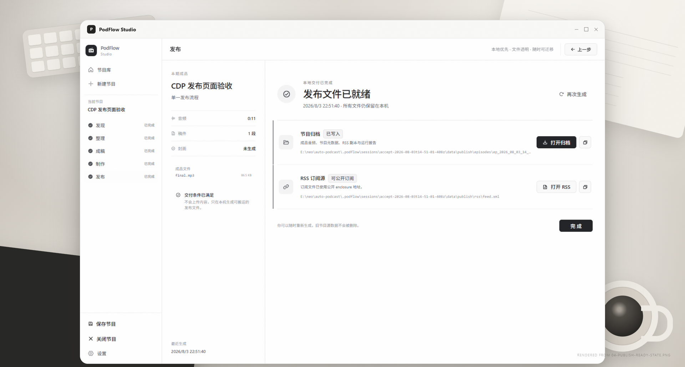

<div align="center">



# PodFlow Studio

**本地优先的 AI 新闻播客制作工作台**

从素材发现、整理与事实卡片，到口播稿、配音、音频成片和 RSS 发布包，一条工作流完成一期节目。

**PodFlow Studio 支持 AI 驱动的全流程自动化，但自动化不以牺牲内容质量为代价。只有通过来源核验、编辑门禁、声音质检与人工终审的内容，才能进入正式发布。**

[产品介绍](https://www.liuminxin.cn/works/podflow-studio) · [站内试听](https://www.liuminxin.cn/works/podflow-studio#episode-player) · [订阅 RSS](https://www.liuminxin.cn/podflow-studio/feed.xml) · [下载 Windows 0.2.0](https://github.com/liuminxin45/podflow-studio/releases/tag/0.2.0) · [查看源码](https://github.com/liuminxin45/podflow-studio)

</div>

## PodFlow Studio 是什么

PodFlow Studio 面向独立创作者和小型编辑团队，把每天重复的新闻播客生产流程放进一个统一的桌面工作台。默认节目品牌为 `PodFlow 晨报`，采用 6 条快讯加 1 条重点解读的 12 至 15 分钟结构；素材或来源不足时会阻断公开发布，不以无来源内容凑满时长。

它不是一个只会“生成文案”的聊天框。素材会沿着明确的编辑链路前进：先收集和整理来源，再形成事实卡片与可编辑稿件，最后进入配音、音频装配和发布。关键节点保留人工确认，来源与 AI 补充知识也会分开呈现。

自动化负责消除重复劳动，不负责替代编辑判断。PodFlow Studio 将“精品内容”定义为通过明确机器门禁和人工终审的正式产物；任何来源不足、事实检查未完成、稿件未通过门禁、发音未确认、音频质量不合格或缺少人工终审的节目，都必须阻断发布。

```text
发现素材 → 整理与研究 → 事实卡片 → 口播稿 → 配音 / 录音 → 音频成片 → RSS / 发布包
```

## 核心能力

- **发现素材**：从 RSS、网页、手动笔记、AI News Daily 和 NewsNow 聚合源采集内容，并按时效、主题和数量筛选。
- **AI 发现深度稿**：先由 AI 分析与网络研究判断事件的延展价值，再将高潜力选题标为深度稿并继续扩展证据，而不是依赖人工预先标注。
- **整理与研究**：围绕候选选题补充背景、管理参考来源，把网络证据与 AI 知识分开处理。
- **事实驱动写作**：先生成结构化 `FactCard`，再写出口播稿，减少原始素材直接进入生成提示带来的失真。
- **可编辑成稿**：保留生成稿和人工编辑稿；后续 TTS 始终优先使用已编辑版本。
- **可导演配音**：正式节目固定豆包“爽快思思多情感”，按 80 至 140 字、最多 2 句切分，并把情感、强度和分段语速真正传入 Provider；真人录音可替换任意片段。
- **自动成片**：片头与开场重叠、5 个快讯 sting、1 个深度 bridge、片尾与收束重叠；正文不持续铺底乐。成片固定 48 kHz、160 kbps、-16 LUFS ±1、真峰值不高于 -1 dBTP。
- **发布交付**：生成节目音频、`feed.xml`、节目元数据和运行报告，组装为可检查的发布包。
- **本地优先**：工作流和中间产物保存在本机；没有外部 API Key 也能运行完整离线 demo。
- **Agent 可验收**：内置会话隔离的 CLI、机器可读状态、CDP 端点、日志、截图与离线端到端验收。

## 安装

### Windows 安装包

从 [GitHub Releases](https://github.com/liuminxin45/podflow-studio/releases/tag/0.2.0) 下载 0.2.0 的 `.exe` 安装程序。当前安装包尚未进行商业代码签名，Windows SmartScreen 可能显示发布者提示。

### 从源码运行

#### 环境要求

- Node.js 22
- Python 3.13
- Windows 10 / 11（当前主要桌面开发与验证环境）

`npm install` 会按当前平台安装 PodFlow 使用的 FFmpeg，无需另外配置系统 FFmpeg。Python 依赖仍由 `npm run setup:python` 安装到项目 `.venv`。

```bash
git clone https://github.com/liuminxin45/podflow-studio.git
cd podflow-studio
npm install
npm run setup:python
npm run cli -- doctor
npm run dev
```

首次启动后，在「设置」中配置实际要使用的模型、搜索和语音服务。你不需要一次配置所有 Provider；只配置当前工作流需要的服务即可。

## 最快上手

如果想先确认完整链路是否可用，运行离线 demo：

```bash
npm install
npm run setup:python
npm run demo:news
```

这条路径不依赖外网、LLM Key 或 TTS Key。没有真实 TTS 时会生成 mock WAV，再由 npm 安装的 FFmpeg 完成音频处理并输出 `final.mp3`。若 npm 安装不完整，流程会明确失败并报告缺失的运行时依赖。

运行完成后，主要结果位于 `examples/demo-news/output/`：

```text
facts.json                 # 结构化事实卡片
script.generated.json      # AI / deterministic 生成稿
script.edited.json         # 可人工编辑的最终稿
final.mp3 或 final.wav      # 成片音频
feed.xml                   # RSS feed
run_report.json            # 运行结果、告警与降级信息
dist/episodes/<episode_id> # 完整发布包
```

## 使用方式

桌面端的每个区域只负责一类清晰任务：

1. **发现**：选择内容源和时间范围，查看来源级采集进度，由 AI 与网络研究先识别值得继续追踪的素材。
2. **整理**：收敛选题，将高潜力事件提升为深度稿，继续补充证据、背景和分析角度。
3. **成稿**：检查事实卡片和节目结构，编辑真正要播出的口播稿。
4. **制作**：为稿件分段生成语音，或替换为真人录音，然后自动装配最终音频。
5. **发布**：检查节目元数据、音频和警告，导出 RSS 与发布包。

默认 preset 为 `morning_news_brief`，公开节目固定“6 条快讯 + 1 条重点解读”，目标 14 分钟、允许范围 12 至 15 分钟。素材或独立来源不足时必须先补齐，不通过调整默认数量绕过公开门禁。

## CLI 与 AI Agent

PodFlow CLI 为人工操作和 AI Agent 提供同一套进程控制与验收入口。每个会话拥有隔离的数据、Electron profile、日志和验收产物；CDP 只绑定本机回环地址。

```bash
npm run cli -- doctor --json
```

从源码部署 CLI 可在 Windows 运行 `powershell -ExecutionPolicy Bypass -File scripts/setup-local.ps1`。它会安装锁定依赖并运行环境诊断，但不会读取或保存任何 API Key。

正式候选节目也能从素材发现开始完全由 CLI 生成。该路径强制使用可追踪证据、实际
LLM 成稿和正式 TTS，并在机器门禁通过后等待绑定最终 MP3 SHA256 的人工终审。命令、
验收、生产阶段和 GitHub Actions 配置见 [CLI 参考](docs/cli.md)；当前声音、混音和审核
门禁见 [晨报音频生产规范](docs/morning-news-audio-spec.md)。

### 音乐与授权

正式品牌 cue 派生自 HoliznaCC0 的 [Make Funk](https://freemusicarchive.org/music/holiznacc0/bassic/make-funk/)，曲目页明确标注 CC0 1.0 与纯音乐。项目保存原始 SHA256、取得日期、裁剪区间与派生文件指纹。素材经裁剪、淡入淡出和响度处理，第三方音乐仍为 CC0，不改写为 Apache-2.0。完整记录见 [音频权利文件](assets/audio/RIGHTS.md)。

全部贡献者与使用者文档见 [文档索引](docs/README.md)。

## 关键设计

### 事实卡片，而不是素材拼接

`FactCard` 是来源与稿件之间的事实层。当前 schema v2 用 `evidence[]` 保存可追踪证据，用 `claims[]` 保存逐主张模型核验结果；新闻段必须同时绑定 `source_fact_ids` 与已支持的 `source_claim_ids`。写作节点消费经过整理的事实，而不是把网页原文直接拼进 Prompt。

### 人工编辑稿优先

系统同时保留生成稿和 `edited_script`。一旦存在人工编辑稿，TTS 和后续制作链路会优先使用它，避免重新生成覆盖已经确认的表达。

### 可解释的降级

外部模型不可用时，只能产生标记为 `demo_only` 的诊断产物，并把真实原因写入 `run_report.json`；不会降级成可发布结果。FFmpeg 是由 npm 管理的必需运行时，缺失时会明确失败。

### 本地预览与公网发布分离

机器门禁全部通过但尚未人工终审时，可用 `package --preview-only` 生成内部预览，目录固定为 `out/previews/<episode>/<audio-sha-prefix>/`。预览不生成 RSS、公开 URL 或正式发布目录；人工终审通过且与当前 MP3 SHA256 匹配后，才允许正式打包与发布。

### 导出与发布公开节目包

正式节目统一通过 `podflow produce` 完成渲染、指纹审批、打包和发布。发布包只消费
Review 节点生成且绑定当前音频的 `publish_ready` 状态；Provider、质量配置、时长与
音频指标均来自真实产物，不使用固定占位值。完整阶段和固定资产列表见
[CLI 参考](docs/cli.md)。

正式 MP3 只存放在公开的 `liuminxin45/podflow-morning-feed` GitHub Release；个人主页在 Pages 构建时读取 Release API、校验固定资产和 SHA256，只复制封面、章节与文字稿等小文件。RSS enclosure 与站内原生播放器直接使用不可变 MP3 Release URL，因此主页 Git 历史不会随每日音频持续膨胀。已存在的日期型 Release 不会被覆盖；同步失败时新部署会被阻断，线上旧版本保持不变。

## 配置

桌面端「设置」可以管理常用配置；仓库中的 `config.example.yaml` 展示了完整配置结构。密钥请放在本地环境或桌面端配置中，不要写入仓库。

当前可接入的能力包括：

- 由 Python / Pydantic AI Agent 统一执行的 OpenAI、Anthropic、Gemini、OpenRouter、Ollama 与 DeepSeek
- Codex、Claude Code 等已配置的本地 CLI Agent
- Edge TTS 与 OpenAI-compatible TTS
- RSS / 网页内容源
- AI News Daily 与 NewsNow 聚合源
- 可选搜索服务与人工笔记

## 开发与验证

```bash
npm run dev             # 启动 Vite + Electron 开发环境
npm run lint            # 检查 TypeScript、React 与脚本
npm run lint:py         # 检查 Python
npm run build           # TypeScript 检查并构建前端
npm run test:run        # 运行前端测试
npm run verify:offline  # 运行无需外部服务的校验
npm run demo:news       # 运行端到端离线示例
npm run acceptance:cdp # 运行隔离的 Electron/CDP 主路径验收
```

README 主图来自 Electron/CDP 离线验收捕获的真实素材发现界面，产品界面没有经过重绘。

项目主要由 Electron、React、TypeScript 和 Python 组成。React 只提交类型化 AI 任务；Electron 负责凭据边界、Python Gateway 生命周期、IPC 和取消传播；Python 的 Agent Registry 与 Pydantic AI Runtime 是唯一 AI 执行中心。跨进程只传 PodFlow JSON 契约，不公开任意 Prompt/messages 接口。

## 当前边界

PodFlow Studio 当前优先保证“单人新闻早报”的完整闭环。以下方向仍属于次要或实验能力：

- 多主持人节目
- 长篇故事型播客
- 无人工终审的正式云端发布
- 真实 TTS Provider 在所有网络环境下的生产级稳定性

它不是通用音频剪辑器、新闻 CMS 或海量数据源聚合平台。产品目标是让创作者用一条可检查、可编辑、可恢复的流程稳定完成节目。

## 开源协议

PodFlow Studio 采用 [Apache License 2.0](LICENSE)，对应 SPDX 标识为
`Apache-2.0`。项目归属信息见 [NOTICE](NOTICE)；第三方依赖与素材仍遵循各自许可证。
